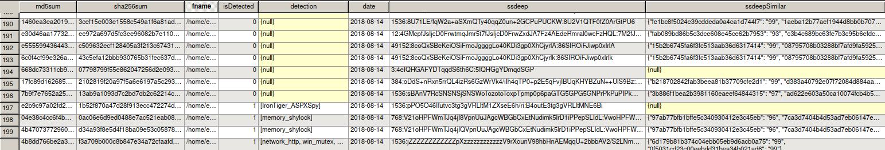
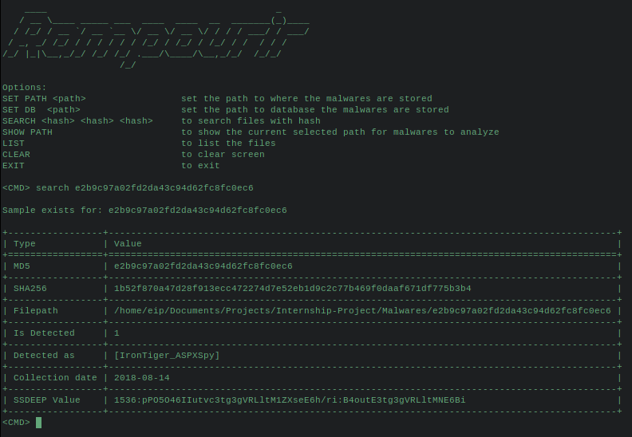
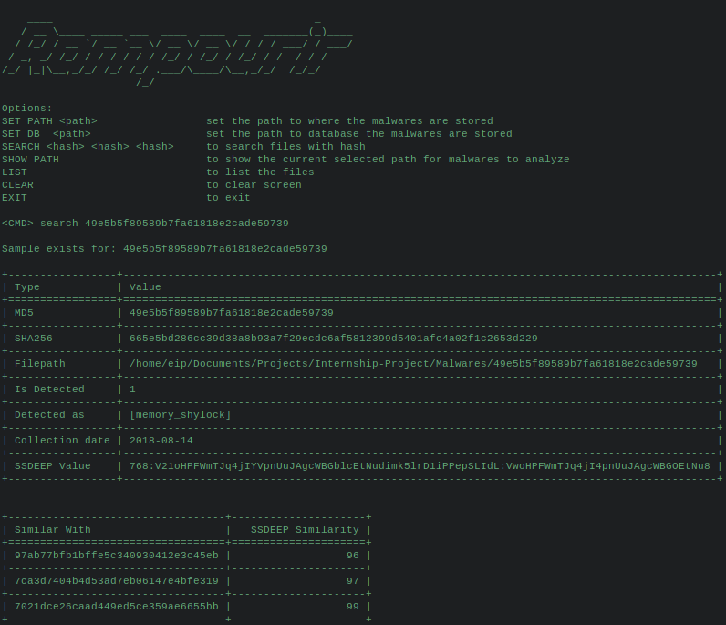

## INTERNSHIP - PROJECT

Automated malware collection and classification with signature based scan.

Main script is Allonsy.py, it collects the malwares from specified sources below and scans them with the existing rules, checks ssdeep values with the existing malwares in the database, when 90% or upper match is found, it is written to database. 

It saves the collected malwares under $PWD\Malwares path and creates Sqlite3 database for the malwares as in the image below.

### Managing Collected Samples

#### Rampourir.py

You can list samples collected. You can search for a sample, with md5 or sha256.

It also shows the similar samples if there is any.

### Malware Sources

* [Malshare](https://malshare.com) => Added
* [Malc0de](http://malc0de.com/database/) => Added
* [VX-Vault](http://vxvault.net/ViriList.php) => Added
* [Tracker-h3x](http://tracker.h3x.eu/about/400) => Added
* [Malakel](http://malwaredb.malekal.com/index.php?page=1) => It is not being updated (Cumulative downloader will be written for contribution to database) => Added
* [Cybercrime-Tracker](https://cybercrime-tracker.net/) => canceled, not up to date

### Yara rule sources

* [Yara-Rules](https://github.com/Yara-Rules/rules) => Added

### Workflow of YARA rule collection

* Yara rules will be collected from source or added manually based on personal analysis of samples.
* When a new rule is gathered, old **undetected** samples will be checked again with new rules.

### Workflow of Scanner

* New malwares will be checked and hashes will be written to database at certain frequency(probably daily)
* If sample doesn't exist in database it will be pulled.
* Pulled samples will be scanned with yara rules and detections will be saved database.

#### TO-DO

* Yara scanner script will be implemented for scanning existing malwares when there is a new rule added. 